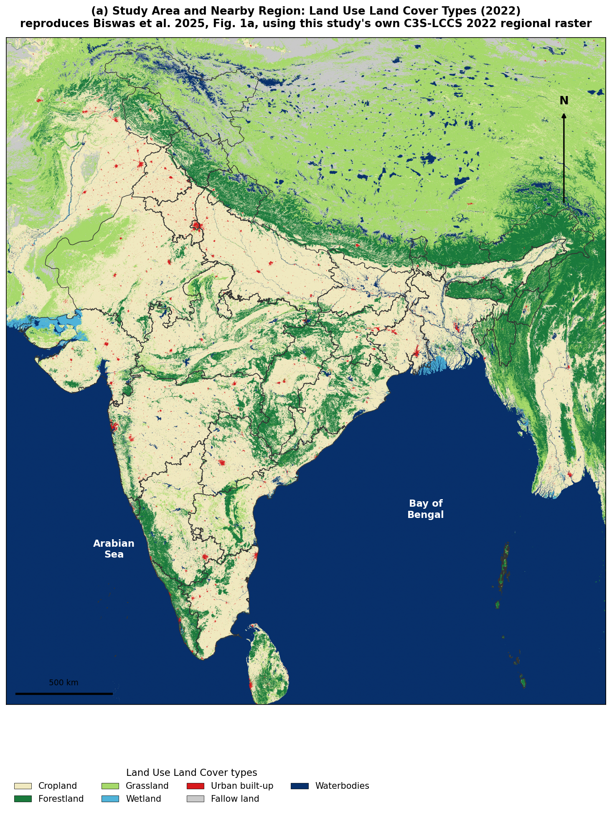
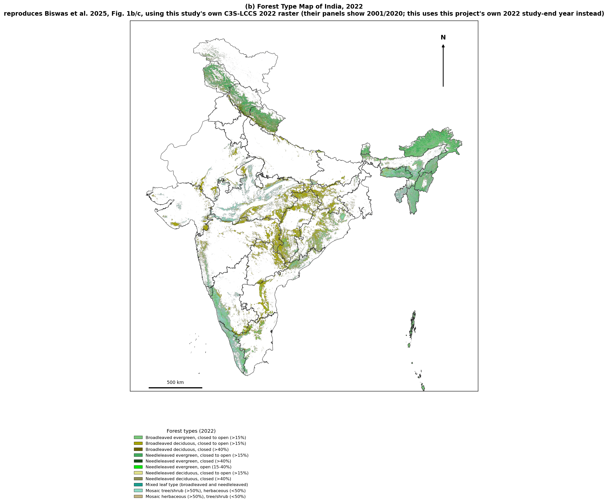

> **Editorial note to the user (not part of the manuscript text — delete before submission).**
> This section was assembled by reading, in full or in the relevant parts, the following
> source files, and reorganizing their already-established content — no equation, proof,
> hyperparameter, or result number below was invented; every numeric claim is traceable to
> one of these files: `METHODOLOGY.md`, `CLAUDE.md`, `Step1_FirePointExtraction_Audit_and_Documentation.md`,
> `Step2_NDVI_Audit_and_Documentation.md`, `Step3_LST_Audit_and_Documentation.md`,
> `Step4_FLDAS_Audit_and_Documentation.md`, `Step5_TerrainAccessibility_Audit_and_Documentation.md`,
> `Step6_IntegratedAlignment_Audit_and_Documentation.md`, `Step7_LandCover_Feature_Selection_Rationale.md`,
> `Step7_SusceptibilityModel_Audit_and_Documentation.md`, `Step8_CDRPINN_Audit_and_Documentation.md`,
> `Integrated_Analysis/preprocessing.py`, `Integrated_Analysis/hp_search_rf.py`,
> `Integrated_Analysis/hp_search_maxent.py`, `Integrated_Analysis/Model_Outputs/rf_hp_search_result.json`,
> `Integrated_Analysis/Model_Outputs/maxent_hp_search_result.json`, `CDR_PINN_Diffusion_Design.md`,
> `CDR_PINN_Diffusion_Design_v2.md`, `CDR_PINN_Advection_Design.md`, `CDR_PINN_Reaction_Design.md`,
> `CDR_PINN_Final_Design_STEP_D.md`, `CDR_PINN_Methodology_Section.md`, `FULL_EXPERIMENT_LOG.md`, and the
> live implementation files `Physics_Informed_FireRisk_Model/cdr_pinn/{train_standard_protocol.py,
> preprocessing.py, losses.py, model.py, hp_search_weight_decay.py, hp_search_weight_decay.log,
> run_validation_tracks.py, jackknife_test.py}`. I did **not** re-read the Terrain/Accessibility or
> FLDAS `README.md` files line-by-line (their content is already fully reflected in the Step 4/5
> audit docs, which I did read in full, so Sections 5–6 draw from those); flag if you want the raw
> READMEs cross-checked too. **Numbers that conflicted across sources, resolved as follows — please
> double-check these specific spots:**
> (1) **CDR-PINN Track A / canonical checkpoint**: `CDR_PINN_Methodology_Section.md`'s Table 5 and
> the term-ablation table both still show Track A = **0.9406** (the original 2026-08-20 run, no
> validation set). `FULL_EXPERIMENT_LOG.md`'s entry A7 (`train_standard_protocol.py`, 2026-08-22)
> reports **val AUC = 0.9351, test AUC = 0.9398** on a genuine 65/15/20 split and explicitly states
> this "supersedes every earlier `full_cdr` number in this study." I have used **0.9398/0.9351** as
> the canonical Track-A number in Section 10 and flagged 0.9406 as the historical, pre-standard-
> protocol figure everywhere else (term-ablation, Table 5 reproduction) — but I could not confirm
> whether A7's checkpoint is the *same* one the B1/B2/B3 re-run (A2b, also 2026-08-23) was scored
> against, since they come from two different scripts (`train_standard_protocol.py` vs
> `run_validation_tracks.py`). Worth a direct check before this goes in a submission.
> (2) **RF's own validated-search test AUC**: `Step7_SusceptibilityModel_Audit_and_Documentation.md`'s
> prose states "test ROC-AUC 0.9701, AP 0.6961" for `hp_search_rf.py`'s winner, but the actual JSON
> it was computed from (`rf_hp_search_result.json`, which I read directly) contains
> `test_auc: 0.96979` (rounds to **0.9698**, not 0.9701) alongside the identical `test_ap: 0.6961`.
> I used the JSON's own number (0.9698) as ground truth in Section 8; the audit doc's 0.9701 appears
> to be a transcription slip. (3) **RF/MaxEnt headline numbers evolved across three feature-set
> versions** (55-feature pre-specific-humidity → 57-feature final) in a way that is real project
> history, not a contradiction, but produces several similar-looking-but-different number pairs in
> the source docs (e.g. spatial-block CV 0.9501±0.0031 vs the final 0.9498±0.0035 for RF) — I used
> the final, 57-feature, most-recently-dated numbers throughout and noted the version each pertains to.

## 1. Study Area, Period, and Data Sources

### 1.1 Study area and period

The study domain is the Republic of India, defined by the dissolved polygon of
`India_State_Boundary.shp` (37 constituent state/union-territory polygons merged via
`union_all()`) rather than `India_Country_Boundary.shp`, whose ~60 degenerate near-zero-area
sliver polygons near the Palk Strait (79–79.5°E, 9–9.3°N) corrupt point-in-polygon and plotting
operations without materially changing the retained point set. The shapefile ships without a
usable embedded CRS declaration; every step of the pipeline sets its raw coordinates explicitly
to EPSG:3857 (Web Mercator, meters) before reprojecting to EPSG:4326 (WGS 84, degrees) for
analysis.

The study period is fixed at **2000-11-01 to 2022-12-15** (266 months) across every step of the
pipeline. This upper bound is a hard data constraint, not a convenience: the ESA-CCI/C3S
land-cover archive used to forest-filter fire points (Step 1) and to build the LULC
forest-fraction feature (Step 6) does not exist beyond 2022, so extending the fire archive
further would produce forest-validated points for some years and unfiltered points for others —
a correctness choice. Every later step's monthly features are indexed to this same 266-month
grid and joined against one another on the `(year, month)` key.

### 1.2 The common analysis grid

Step 2 (NDVI feature engineering) establishes the pipeline's canonical spatial grid:
**3641 × 3504 pixels, EPSG:4326, ≈0.01° (≈1 km) resolution**, derived directly from the native
resolution of the MOD13A3.061 monthly NDVI product. Every later step (LST, FLDAS climatic
variables, land cover, terrain, accessibility, the assembled feature stack) reprojects its own
native-resolution product onto this exact grid before Step 6 stacks them, rather than each step
choosing its own working resolution. Reprojection direction determines the resampling method
used pipeline-wide: coarse-to-fine (upsampling — FLDAS 0.1°→0.01°) uses bilinear interpolation,
the literature-standard choice for continuous fields; fine-to-coarse (downsampling — ESA-CCI
300 m land cover, SRTMGL3 90 m DEM → 1 km) uses area-weighted averaging (`Resampling.average`),
the correct choice for fractional/categorical aggregation. After India-boundary masking and
validity filtering on `ndvi_mean`, the working analysis population is **4,161,009 in-India
pixels** (32.6% of the 12,758,064-cell full grid), the exact figure reproduced identically by
Steps 2, 6, and 7.

Fire points are placed onto every raster grid in the pipeline by one shared method — direct
**affine pixel-lookup**, not a nearest-neighbor spatial join. The general GDAL/rasterio
geotransform maps pixel indices to geographic coordinates via six coefficients:

$$
x = a\cdot\text{col} + b\cdot\text{row} + c, \qquad
y = d\cdot\text{col} + e\cdot\text{row} + f
$$

| Coefficient | Meaning |
|---|---|
| $a$ | pixel width — change in $x$ (longitude) per step in `col` |
| $b$ | row rotation/shear — change in $x$ per step in `row` |
| $c$ | $x$-coordinate of the upper-left corner of the upper-left pixel (origin longitude) |
| $d$ | column rotation/shear — change in $y$ per step in `col` |
| $e$ | pixel height — change in $y$ (latitude) per step in `row` (negative: row increases downward, latitude decreases southward) |
| $f$ | $y$-coordinate of the upper-left corner of the upper-left pixel (origin latitude) |

$b$ and $d$ are the shear/rotation terms, nonzero only for a raster skewed relative to true
north. Every raster in this pipeline (MODIS, ESA-CCI, FLDAS, SRTM, all reprojected to plain
EPSG:4326) is a standard north-up, axis-aligned grid, so $b=d=0$ identically — confirmed
directly from the integrated stack's own transform ($a=0.01,\ b=0.00,\ c=68.20,\ d=0.00,\
e=-0.01,\ f=37.09$). With $b=d=0$ the two equations decouple ($x=a\cdot\text{col}+c$,
$y=e\cdot\text{row}+f$) and invert directly to the pixel-lookup formula actually used:

$$
\text{col} = \operatorname{round}\!\left(\frac{\text{lon} - c}{a}\right), \qquad
\text{row} = \operatorname{round}\!\left(\frac{\text{lat} - f}{e}\right)
$$

This is exact for the regular lat/lon grids used throughout (ESA-CCI/C3S, NDVI, LST, FLDAS,
terrain, accessibility) and trivially vectorizes on GPU, in contrast to a `geopandas`/`shapely`
spatial join.

### 1.3 Data sources

| Product | Sensor / model | Native resolution | Temporal coverage used | Role |
|---|---|---|---|---|
| MODIS Collection 6.1 FIRMS active-fire archive | MODIS (Terra/Aqua) | point detections | 2000–2022 | Ground-truth fire-occurrence label (Step 1) |
| ESA-CCI/C3S Land Cover (LCCS) | multi-sensor land-cover CCI | 300 m, annual | 1992–1995, 2000–2022 | Forest-class filtering (Step 1), 22-class fractional composition + forest fraction (Steps 4, 6) |
| MOD13A3.061 NDVI | MODIS (Terra) | 1 km, monthly | Nov 2000–Dec 2022 | 9 NDVI-derived features (Step 2); establishes the canonical grid |
| MOD11A2.061 LST | MODIS (Terra) | 1 km, 8-day composite (aggregated to monthly) | 2000–2022 (1,013 composites) | Day/night LST, DTR, climatology/anomaly/trend (Step 3) |
| FLDAS_NOAH01_C_GL_M.001 (Noah LSM, MERRA-2 + CHIRPS forced) | FLDAS land-surface model | 0.1° (~11 km), monthly | Nov 2000–Dec 2022 (266 files) | 7 climatic variables (Step 4) |
| SRTMGL3 DEM | SRTM (shuttle radar) | 90 m | static | Elevation, slope, aspect (Step 5a) |
| Geofabrik OpenStreetMap extracts | OSM, 2022 vintage | vector | 2022 snapshot | Distance to roads/railways/waterways (Step 5b) |

## 2. Step 1: Fire Point Extraction

**Figure 1.** The study area and its land cover, reproducing Biswas et al. (2025) Fig. 1,
built from this project's own real, unclipped C3S-LCCS 2022 regional raster (lat 6.00–37.50°N,
lon 67.50–98.00°E — the first figure in this pipeline to use that raw file directly rather
than a downstream India-masked product).



*(a) The study area and nearby region (India, Pakistan, Nepal, Bangladesh, Myanmar, Sri Lanka)
with different land cover types, reclassified into Biswas et al.'s 7-category LULC legend via
this project's own disclosed LCCS-code crosswalk — "Forestland" reuses Step 1's own 13-code
`FOREST_CODES` definition for internal consistency rather than a second, one-off definition.*



*(b) The forest type map of India for 2022 — this project's own study-end year, rather than
duplicating Biswas et al.'s 2001/2020 panel pair. All 11 forest subclasses in their Fig. 1
legend are genuinely present in India's real 2022 raster (confirmed via a full-resolution
histogram), dominated by broadleaved deciduous (924,901 px) and broadleaved evergreen
(657,773 px) cover.*

The raw MODIS Collection 6.1 FIRMS archive for the India region
(`fire_archive_M-C61_772720.csv`) contains **2,804,373** raw detections spanning 2000–2022. This
is reduced to the pipeline's ground-truth fire-point set through a fixed sequence of filters:

| Stage | Rows remaining |
|---|---:|
| Raw MODIS archive | 2,804,373 |
| After India bbox pre-filter (68.0–97.5°E, 6.5–37.5°N) | 2,801,347 |
| After exact India polygon clip (`shapely.contains_xy`) | 1,599,471 |
| After study-period clip (2000-11-01–2022-12-15) | 1,599,471 |
| After exact-duplicate removal (`lon, lat, acq_date`) | 1,599,466 |
| After forest-LULC pixel filter (per study year) | **541,545** |

The polygon clip is applied as a cheap rectangular bounding-box pre-filter followed by an exact
point-in-polygon test against the dissolved state boundary; the second stage removes
**1,201,876 points (42.9% of the bbox-passing set)** that lie inside the rectangle but outside
India's real border (chiefly Sri Lanka, Nepal, Bangladesh, Myanmar, and southern Pakistan) — a
substantial, quantified contamination source a simpler bounding-box-only pipeline would retain.

Forest classification uses a binary mask over the ESA-CCI/C3S LCCS land-cover legend, built from
the 13-code forest class set (Sannigrahi et al., 2018, as cited in Biswas, Mahato & Joshi, 2025,
p. 4863):

$$
\text{FOREST\_CODES} = \{50,\,60,\,61,\,62,\,70,\,71,\,72,\,80,\,81,\,82,\,90,\,100,\,110\}
$$

Each fire point is mapped to its exact LULC grid cell for that point's own acquisition year
(not a single static forest mask) via the affine pixel-lookup formula of §1.2:

$$
\text{col} = \operatorname{round}\!\left(\frac{\text{lon} - c}{a}\right), \qquad
\text{row} = \operatorname{round}\!\left(\frac{\text{lat} - f}{e}\right)
$$

which is exact for ESA-CCI's regular grid. Of the 1,599,466 India-clipped, deduplicated points,
**541,545 (≈33.9%)** fall on forest land cover across the study period. National forest cover,
computed from the same yearly rasters used for filtering, holds consistently within
**9.86–10.43%** of India's land area across all 23 study years — an internal-consistency check
that the same forest definition is applied uniformly year over year (this consistency matters
downstream, since Step 6 reuses this exact 13-code definition for its own forest-fraction
feature, reconciled 2026-08-10 after an earlier 11-code mismatch was found and fixed).

**External validation.** A supplementary analysis cross-validates this extraction against MODIS
MCD64A1.061 burned area, both as a direct correlation and as a year-by-year comparison against
Biswas et al.'s own published annual fire counts:

- **Pearson $r = 0.915$, Spearman $\rho = 0.835$, $p < 0.0001$, $n = 23$ years** (full
  Jan–Dec coverage per year, re-run 2026-08-20 once previously-missing Jan/Feb source months
  finished downloading — an earlier Mar–Dec-restricted version of this figure, $r=0.824$, is
  superseded).
- Against Biswas et al.'s own reported annual fire counts, this project's extraction runs
  consistently **0.5–2.4% higher** across all 20 overlapping years (2001–2020) — a small,
  explainable, non-random offset that functions as external validation of the extraction
  methodology rather than a discrepancy.

Deduplication is an exact-key operation on `(longitude, latitude, acq_date)` with no coordinate
rounding and no FIRMS confidence-field filtering; the `confidence` and `type` columns are
preserved through to the final output but not used as filters — a disclosed, deliberate gap
(4.29% of the final 541,545 points carry `confidence < 30`), deferred rather than applied
retroactively because this is the pipeline's ground-truth label set and any change here would
cascade into every downstream model.

## 3. Step 2: NDVI Feature Engineering

Nine features (plus a tenth fire-occurrence raster) are derived from 266 months of MOD13A3.061
1 km monthly NDVI, computed on the full 3641×3504 national grid.

**F1 — QA-filtered mean.** `pixel_reliability` values $\{0=\text{Good}, 1=\text{Marginal}\}$ are
retained, $\{2=\text{Snow/Ice}, 3=\text{Cloudy}, -1=\text{Fill}\}$ dropped, applied per-pixel
per-month before any temporal aggregation:

$$
F1_{ij} = \frac{1}{n}\sum_{t} \text{NDVI}(t,i,j) \quad \text{over valid months only}
$$

**F2 — Climatology.** A fixed 2001–2020 baseline, per-pixel, per-calendar-month mean:

$$
\bar\mu_{ij}^{(m)} = \operatorname{mean}\{\text{NDVI}(y,m,i,j) : y \in [2001, 2020]\}
$$

**F3 — Anomaly.** A raw departure from climatology, matched by calendar month and **not**
standardized by the local standard deviation:

$$
\delta(t,i,j) = \text{NDVI}(t,i,j) - \bar\mu_{ij}^{(m(t))}
$$

**F4/F5 — Trend and residual (classical 2×12-MA additive decomposition).** A centered 2×12
moving-average trend-cycle estimator, a 13-tap symmetric window with half-weight at both ends,
$w = [0.5,1,1,1,1,1,1,1,1,1,1,1,0.5]$:

$$
\text{Trend}(t) = \frac{\sum_{k=-6}^{6} w_k \cdot x(t+k)}{\sum_{k=-6}^{6} w_k}
$$

(undefined for the first/last 6 months, 254/266 months valid). The series is detrended, a
seasonal component is computed as the per-calendar-month mean of the detrended series over the
full 266-month record, and the residual follows the classical additive identity
$\text{NDVI} = \text{Trend} + \text{Seasonal} + \text{Residual}$. F4 is the time-mean of the
trend component; F5 is the time-mean of the residual.

**F6 — Mann-Kendall trend $\tau$**, applied to the trend component (F4's underlying series),
over $T = 266$ months. The classical Mann-Kendall $S$-statistic, via a full pairwise lag sweep:

$$
S = \sum_{i=1}^{T-1}\sum_{j} \operatorname{sign}(x_{i+\text{lag}} - x_i), \qquad
\tau = \frac{S}{\binom{n}{2}} = \frac{S}{n(n-1)/2}
$$

using each pixel's own valid observation count $n$ (requires $n \ge 10$). Significance is
assessed via the normal approximation:

$$
\operatorname{Var}(S) = \frac{n(n-1)(2n+5)}{18}, \qquad
Z = \frac{S \mp 1}{\sqrt{\operatorname{Var}(S)}}
$$

with a two-sided p-value computed via the error function ($\operatorname{erf}$), thresholded at
$p<0.05$ separately for browning ($\tau<0$) and greening ($\tau>0$) pixels. On this run:
147,206 significant browning pixels, 3,731,210 significant greening pixels. Steps 3 and 4 apply
the identical $S$/$\tau$/normal-approximation significance formula for their own Mann-Kendall
tests, ensuring one consistent trend-significance methodology across the pipeline.

**F7 — CVSI (Cumulative Vegetation Stress Index).** A project-specific, unpublished index — no
literature precedent exists for it:

$$
\text{CVSI}(t,k) = \sum_{\text{lag}=1}^{k} \max(-\delta_{t-\text{lag}}, 0)
$$

the accumulated pre-fire NDVI anomaly deficit over a trailing $k$-month window. The optimal lag
$k^*$ is selected by maximizing mutual information between quantile-binned (10-bin) CVSI values
and real fire/no-fire pixel-month labels from Step 1 (against a random, class-balanced,
`seed=42` sample of never-burned background pixels), swept over $k=1$–$12$:

$$
k^* = \operatorname*{argmax}_k I(Y;\, \text{CVSI}_k)
$$

Mutual information rises monotonically for $k=1$–$8$ (peaking at $0.01257$, next-best $k=7$ at
$0.01157$) then falls for $k=9$–$12$ — a genuine interior optimum, **$k^*=8$**.

**F8 — LISA cluster map.** Queen-contiguity spatial weights (row-standardized), computed on an
8×-coarsened (456×438) grid for tractability. Global Moran's I:

$$
I = \frac{n}{\sum_{ij} w_{ij}} \cdot \frac{\sum_{ij} w_{ij}(x_i-\bar x)(x_j-\bar x)}{\sum_i (x_i-\bar x)^2}
$$

measured $I=0.8322$ ($z=742.1$, $p\approx0$, analytical normal approximation). Local Moran's I
(LISA) per pixel:

$$
I_i = \frac{x_i - \bar x}{\sigma^2}\sum_j w_{ij}(x_j - \bar x)
$$

computed via 199 conditional permutations (`seed=42`), classified into the standard quadrant
codes (HH/LH/LL/HL) and filtered to $p_{\text{sim}}<0.05$: 13,412 HH, 9,254 LL, 197 LH, 77 HL
significant coarse cells.

**F9 — NDVI–fire breakpoint threshold.** A piecewise (two-regime) logistic regression fit by
maximum likelihood — not a ROC/Youden's-$J$ cut, not a decision-tree split:

$$
P(\text{fire}=1 \mid \text{NDVI}=x) =
\begin{cases}
\sigma(a_1 + b_1 x) & x \le \theta \\
\sigma(a_2 + b_2 x) & x > \theta
\end{cases}
$$

fit by minimizing binary cross-entropy jointly over $(a_1,b_1,a_2,b_2,\theta)$ via multi-started
(25-point grid) Nelder–Mead, on a balanced case-control subsample (up to 100k positive + 100k
negative, `seed=42`), both nationally and per biogeographic zone (rectangular approximations of
Rodgers & Panwar 1988 zones). All-India $\theta^*=0.535$ on the currently-verified run (an
earlier corrected national figure of $0.529$ predates the 2026-08-21 India boundary-mask fix);
plus per-zone thresholds (Western Ghats, Northeast, Central India, Deccan, Himalayan). A
2026-08-10 fix bounded $\theta$ to the physically valid NDVI range and rejected multi-start
winners whose solution left one regime with $<1\%$ of the sample as non-identifiable regime
collapse rather than a genuine threshold — this corrected a previously invalid Himalayan-zone
estimate ($\theta^*=-0.613$, outside $[-1,1]$) caused by MLE non-identifiability on a flat NLL
plateau, not by weak signal or small sample size (both were directly ruled out).

**F10 — Fire-occurrence raster.** All 541,545 Step 1 points rasterized onto the NDVI grid
(100% in-bounds), yielding 270,655 distinct burned pixels (2.12% of the grid).

## 4. Step 3: LST Analysis

The MOD11A2.061 8-day, 1 km MODIS Terra LST archive (1,013 composites, 2000–2022) is processed
into pixel-level thermal features. `LST_Day_1km`/`LST_Night_1km` are QA-filtered against their
respective QC bands (Good/Marginal reliability retained). Diurnal Temperature Range is a direct
difference with its own independently-computed climatology, anomaly, and trend (not derived by
differencing the day/night $\tau$ values):

$$
\text{DTR} = \text{LST}_{\text{Day}} - \text{LST}_{\text{Night}}
$$

Climatology (2001–2020 baseline), anomaly, and Mann-Kendall trend use formulas identical to
Step 2's F2/F3/F6 (same streaming-accumulator climatology, same calendar-month-matched anomaly,
same full-lag-sweep $S$/$\tau$ Mann-Kendall computation with the identical $\operatorname{erf}$-based
normal-approximation p-value). Measured: DTR $\tau$ mean $=-0.104$ (narrowing), stronger than
either Day ($-0.041$) or Night ($+0.043$) alone — consistent with simultaneous day-cooling and
night-warming.

**Benjamini–Hochberg FDR correction.** With roughly 4.17 million independent per-pixel
significance tests, a raw $p<0.05$ threshold produces a large expected count of chance false
positives — the standard field-significance fix in climate science (Wilks, 2006, *J. Appl.
Meteor. Climatol.* 45:1181). For $p$-values sorted ascending $p_{(1)} \le p_{(2)} \le \dots \le
p_{(m)}$, testing at level $\alpha$:

$$
\text{Reject } H_{(i)} \text{ for all } i \le k, \qquad
k = \max\left\{ i : p_{(i)} \le \frac{i}{m}\alpha \right\}
$$

applied per-variable ($\alpha=0.05$) via `statsmodels.stats.multitest.multipletests`. Applied
to Step 3's own three Mann-Kendall runs, the shrinkage is substantial and variable-specific: Day
significant pixels fall from 1,063,120 to 393,838 ($-63\%$), Night from 234,318 to 17,935
($-92\%$), DTR from 2,545,287 to 2,290,051 ($-10\%$) — reported alongside the raw counts, not in
place of them, for transparency.

Fire points are rasterized onto the LST grid via the same affine transform (§1.2); 270,655
pixels (2.02% of the in-India grid) register at least one fire detection. Mean LST-Day anomaly
at fire pixel-months is $+0.75\,^\circ\text{C}$ versus $-0.09\,^\circ\text{C}$ grid-wide (an
$0.84\,^\circ\text{C}$ gap); LST-Night anomaly shows the same pattern at smaller magnitude
($+0.31\,^\circ\text{C}$ vs. $+0.02\,^\circ\text{C}$) — anomalously warm conditions, not merely
seasonally hot ones, coincide with observed fire occurrence.

## 5. Step 4: FLDAS Climatic Variables and Land Cover

266 monthly FLDAS Noah Land Surface Model files (FLDAS_NOAH01_C_GL_M.001, MERRA-2 + CHIRPS
forced, 0.1°) are cropped to India (335×315 px native grid, 29,056 of 105,525 pixels, 27.5%,
inside the boundary mask) and processed into seven monthly variables:

| Feature | Source variable | Transform |
|---|---|---|
| Wind speed | `Wind_f_tavg` | m/s, as-is |
| Air temperature | `Tair_f_tavg` | K, as-is |
| Precipitation | `Rainf_f_tavg` | kg/m²/s → mm/month ($\times$ days-in-month $\times$ 86400) |
| Surface soil moisture | `SoilMoi00_10cm_tavg` | volumetric → kg/m² ($\times\,0.10\,\text{m}\times1000$) |
| Net longwave radiation | `Lwnet_tavg` | W/m², as-is |
| Specific humidity | `Qair_f_tavg` | kg/kg, national scalar only (not gridded — see below) |
| Relative humidity (derived) | `Qair_f_tavg`, `Tair_f_tavg`, `Psurf_f_tavg` | Magnus/Clausius-Clapeyron-type formula, below |

**Relative humidity derivation.** Labeled "Clausius-Clapeyron" in the source code; more
precisely a Magnus-type empirical approximation derived from it:

$$
e_s(\text{hPa}) = 6.112 \cdot \exp\!\left[\frac{17.67\, T_c}{T_c + 243.5}\right] \quad (T_c \text{ in } ^\circ\text{C})
$$

$$
e(\text{hPa}) = \frac{q\,p}{0.622 + 0.378\,q}, \qquad
\text{RH}(\%) = 100 \cdot \frac{e}{e_s} \; \text{(clipped to } [0,100]\text{)}
$$

Six of the seven variables (all except specific humidity) receive the full
climatology/anomaly/Mann-Kendall-with-FDR treatment identical in structure to Steps 2/3. Measured
Mann-Kendall $\tau$: wind $-0.026$, precipitation $+0.045$, RH $+0.096$, air temperature
$-0.007$, net LW radiation $+0.082$, soil moisture $+0.090$. FDR correction is decisive for air
temperature specifically — its 636 raw-significant pixels collapse entirely to **0** after
correction, indicating its apparent trend was multiple-testing noise rather than a real spatial
pattern; the other variables retain substantial but reduced significant-pixel counts (wind
3,728→1,015; precipitation 2,754→1,840; RH 13,413→10,818; net LW 10,197→7,204; soil moisture
11,615→6,926). Fire-affected pixel-months run measurably drier (precipitation anomaly
$-5.6\,\text{mm}$ vs. $+0.7\,\text{mm}$ grid-wide) and slightly warmer ($+0.29\,\text{K}$ vs.
$-0.01\,\text{K}$) than the grid-wide average.

**A disclosed variable substitution.** Biswas et al.'s Table 3 predictor set uses specific
humidity, not relative humidity. This project computes specific humidity but exports it only as
a national monthly scalar (not per-pixel, never reprojected onto the working grid); relative
humidity, a derived quantity Biswas et al. never used, is the humidity variable that actually
reaches the trained susceptibility models via `fldas_rh_anomaly`. This is a deliberate,
disclosed variable-definition difference from the reference paper, not an oversight in either
direction.

**22-class ESA CCI/C3S land-cover reclassification.** The archive's LCCS legend is
independently verified as structured in two tiers: a Level-1 legend of exactly 22 global classes
(tens-value codes 10, 20, ..., 220) and a finer Level-2 legend of regional sub-variants; the
project's `base_code = (raw_code // 10) * 10` operation collapses Level-2 codes to their Level-1
parent, the correct, standard operation for this legend (verified against ESA CCI's own
documentation and Digital Earth Africa's CCI Land Cover specification). Each of the 22 classes
is reprojected 300 m→~1 km via area-averaging, yielding a per-pixel fractional-cover value per
class. The five largest national mean fractions (2020): rainfed cropland (35.00%), irrigated
cropland (20.94%), broadleaved deciduous tree (8.02%), grassland (5.34%), mosaic natural
vegetation (4.72%).

## 6. Step 5: Terrain and Accessibility

Closes the six of Biswas et al.'s 15 Table 3 predictor variables this pipeline had zero
coverage of prior to 2026-08-18: elevation, slope, aspect (Step 5a) and distance to roads,
railways, waterways (Step 5b).

### 6.1 Terrain (elevation, slope, aspect)

The SRTMGL3 (90 m) DEM is mosaicked from four OpenTopography latitude-band requests (a single
full-India request exceeds the product's area cap). Slope and aspect are computed via a
GPU-vectorized implementation of **Horn's (1981) method**, the algorithm used internally by
ArcGIS, QGIS, and GDAL's `gdaldem`, applied at the DEM's native 90 m resolution *before*
resampling to the shared 1 km grid (to avoid smoothing away gradient detail), with pixel
spacing latitude-corrected for the ~20.2% longitude-spacing compression from south to north
across India. Horn's method computes the gradient via a weighted 3×3 finite-difference kernel:

$$
\frac{\partial z}{\partial x} = \frac{(z_3 + 2z_6 + z_9) - (z_1 + 2z_4 + z_7)}{8\,\Delta x}, \qquad
\frac{\partial z}{\partial y} = \frac{(z_7 + 2z_8 + z_9) - (z_1 + 2z_2 + z_3)}{8\,\Delta y}
$$

where $z_1,\dots,z_9$ index the row-major 3×3 neighborhood around the target cell. Slope and
aspect follow directly:

$$
\text{slope} = \arctan\sqrt{\left(\frac{\partial z}{\partial x}\right)^2 + \left(\frac{\partial z}{\partial y}\right)^2}, \qquad
\text{aspect} = \operatorname{atan2}\!\left(\frac{\partial z}{\partial y},\, -\frac{\partial z}{\partial x}\right)
$$

A sign-convention self-test (south-facing patch → aspect 180°, east-facing → 90°) is run at
execution time and passes. Measured national statistics (India-masked, native 1 km grid):
elevation $-46.9$ to $8{,}169.0\,\text{m}$ (mean $737.2\,\text{m}$); slope $0.00$–$77.31^\circ$
(mean $5.72^\circ$); circular-mean aspect $161.6^\circ$ (south-facing).

**Fire-coincidence result.** Fire points sit at $12.3^\circ$ mean slope versus $5.7^\circ$
nationally — a $+115\%$ enrichment — directly corroborating Biswas et al.'s own finding that
slope is their second-most-important predictor (16.7% MaxEnt contribution).

### 6.2 Accessibility (distance to roads, railways, waterways)

Geofabrik OpenStreetMap extracts (2022 vintage, matching Biswas et al.'s own stated source) are
clipped to `India_State_Boundary.shp` and filtered by feature class (roads:
motorway/trunk/primary/secondary/tertiary + `_link`, 884,940 of 10.7M features; railways:
all except `subway`; waterways: river/canal/stream, excluding `drain`). Distances are computed
via the Euclidean Distance Transform in a custom India-centred equidistant conic projection
(chosen because a flat degree$\times$111 km conversion is wrong by more than 19% across India's
latitude range):

$$
D(p) = \min_{q \in S} \lVert p - q \rVert_2
$$

where $S$ is the rasterized set of target-feature pixels (roads, railways, or waterways
respectively) and $p$ ranges over every grid cell — the same operation implemented by
`scipy.ndimage.distance_transform_edt`. Measured national means: distance to roads
$5.69\,\text{km}$ (max $260.1\,\text{km}$), distance to railways $38.28\,\text{km}$ (max
$1{,}611.2\,\text{km}$), distance to waterways $6.74\,\text{km}$ (max $386.4\,\text{km}$).

**Fire-coincidence results**: distance to roads is $-40.1\%$ at fire points relative to the
national mean ($3.41$ vs. $5.69\,\text{km}$); distance to waterways is $-64.7\%$ ($2.38$ vs.
$6.74\,\text{km}$, the strongest accessibility signal of the three); distance to railways shows
essentially no effect ($+4.8\%$), matching Biswas et al.'s own ranking of railway distance as
their lowest-contribution human-activity factor.

Together, Step 5 brings the pipeline to full 15-of-15 predictor-group parity with Biswas et
al.'s Table 3 (previously 9 of 15).

## 7. Step 6: Integrated Feature Alignment

Step 6 is the pipeline's assembly point: it takes Step 1 (fire points), Step 2 (9 NDVI
features), Step 3 (5 LST features), Step 4 (7 FLDAS-derived climatic features + 22 land-cover
fractional-composition features), Step 5a/5b (3 terrain + 3 accessibility features), and one
feature it builds itself — LULC forest fraction — and stacks all of them onto Step 2's canonical
NDVI grid.

Every upstream source arrives already reprojected onto the shared grid; Step 6 enforces this
with a hard shape-equality assertion (`ValueError` on mismatch) rather than performing any
reprojection of its own, except for the one feature it builds directly. **LULC forest fraction**
binarizes the same 13-code forest mask used in Step 1 (reconciled 2026-08-10) at three snapshot
years (2001 baseline, 2020, 2022) and area-averages each onto the NDVI grid via
`rasterio.warp.reproject(..., resampling=Resampling.average)`, producing a continuous $[0,1]$
fractional-forest-cover value per pixel. National mean forest cover on this basis: 2001 = 10.2%,
2020 = 10.5%, 2022 = 10.7%.

**The 2026-08-21 data-leakage fix.** `forest_frac_recent` (2020), `forest_frac_current` (2022),
and their difference `forest_loss_baseline_to_recent` were dropped from the final feature stack.
The fire label `fire_ever` is a single static binary spanning the full pooled 2000–2022 study
window with no per-event year attached; both non-baseline LULC snapshots fall *inside* that
window, and published literature on post-fire land-cover reclassification documents burned
forest commonly being reclassified to shrubland/agriculture in the next LULC epoch — meaning
these two features could partly encode fire's outcome rather than a pre-fire condition. This is
not a peripheral cleanup: pre-fix, the three dropped features were the model's top-3
Gini-importance features (combined importance $\approx 0.40$). Only `forest_frac_baseline`
(2001) survives, on the reasoning that it is the year closest to a genuine pre-fire condition
given the label's lack of per-event timestamps — an honestly-stated compromise, not a perfect
one. The fix reduced the stack from 60 bands / 62 columns to **57 bands / 59 columns / 55
trainable features**; a subsequent 2026-08-22 addition of specific humidity (§5) brought the
final trainable feature count to **57**.

**The 22 land-cover fractional-composition features.** Unlike Biswas et al., who use ESA-CCI
land cover only to filter fire points to forest pixels (never as a Table 3 predictor), this
project retains all 22 `landcover_frac_LC22_*` classes as model features — a deliberate
extension, testing whether vegetation *type* (not just amount) carries independent predictive
signal. On the tuned, 57-feature Random Forest (test AUC $=0.9704$; see §8), this group carries
a combined Gini importance of $0.1529$ (15.3% of total), concentrated in four classes:

| Class | Gini importance | Interpretation |
|---|---:|---|
| LC22_60 tree_broadleaved_deciduous | 0.0653 | dominant forest type at fire-affected pixels |
| LC22_10 cropland_rainfed | 0.0314 | human-adjacent land use, fire-edge proxy |
| LC22_20 cropland_irrigated | 0.0201 | irrigated variant |
| LC22_100 mosaic_tree_and_shrub | 0.0197 | mixed/degraded forest edge |

These four classes alone account for 89.3% of the land-cover group's own combined importance;
14 of the 22 classes individually contribute $<0.001$ each, and 8 contribute $<0.0001$ each
(near-zero) — a real but heavily concentrated signal, not dimensional bloat overall, though a
defensible pruning pass (collapsing the near-zero classes into one `landcover_frac_other`
bucket) was identified as a documented, not-yet-acted-on option.

India-masking and flattening drops any pixel with a NaN in `ndvi_mean` (the validity anchor);
other feature columns are not independently NaN-checked at this stage, deferred to Step 7's
median-fill. The final artifacts: `Integrated_FireRisk_Stack.tif` (57 bands) and
`Integrated_FireRisk_Pixels.parquet` (4,161,009 rows × 59 columns: 57 features + `lon` + `lat`;
55 trainable features after also dropping `fire_count`/`fire_ever`).

## 8. Step 7: Classical ML Baselines — Random Forest and MaxEnt

### 8.1 Data split

`Integrated_Analysis/preprocessing.py` defines the study's standard protocol for Step 7,
adopted 2026-08-21: a genuine stratified **65/15/20 train/validation/test split** of Step 6's
parquet, `random_state=42`, built as a two-stage stratified split (test carved off first, then
validation from the remainder) so the realized proportions match exactly:

```python
X_trainval, X_test, y_trainval, y_test = train_test_split(
    X, y, test_size=test_frac, stratify=y, random_state=random_state)
relative_val_frac = val_frac / (1.0 - test_frac)
X_train, X_val, y_train, y_val = train_test_split(
    X_trainval, y_trainval, test_size=relative_val_frac, stratify=y_trainval,
    random_state=random_state)
```

with `val_frac=0.15`, `test_frac=0.20`. Feature columns are median-filled on the full table
pre-split; `DROP_COLS = ["lon", "lat", "fire_count", "fire_ever"]`. This split is used
exclusively for hyperparameter *selection* (validation AUC); the model's headline reported
numbers use the notebook's own separate 80/20 stratified split (`stratify=fire_ever`,
`random_state=42`) for direct comparability with the project's earlier, pre-tuning results —
standard nested-CV practice, since the two splits serve different purposes (selecting
hyperparameters vs. estimating generalization).

### 8.2 Random Forest

$$
\text{RandomForestClassifier}(n_{\text{estimators}}=200,\ \text{class\_weight}=\text{"balanced"},\ n_{\text{jobs}}=-1,\ \text{random\_state}=42)
$$

Each tree splits nodes by minimizing weighted Gini impurity,
$G = \sum_{k} p_k(1-p_k)$ over class proportions $p_k$ at a node, with candidate features per
split limited to $\sqrt{n_{\text{features}}}$ (`max_features='sqrt'`). `class_weight="balanced"`
compensates for the $\approx6.5\%$ fire-positive prevalence.

**Validated hyperparameter search** (`hp_search_rf.py`), selecting `max_depth`/`min_samples_leaf`
by validation AUC on the 65/15/20 split (train $=2{,}704{,}655$, val $=624{,}152$, test
$=832{,}202$ rows), holding `n_estimators=200` fixed (its main effect is variance reduction past
a few hundred trees, not bias, so it is not part of the tuned grid):

| `max_depth` / `min_samples_leaf` | Val AUC | Val AP |
|---|---:|---:|
| 20 / 5 (prior literature-default) | 0.9679 | 0.6772 |
| 15 / 5 | 0.9647 | 0.6456 |
| **25 / 3 (winner)** | **0.9694** | **0.6934** |
| 20 / 10 | 0.9680 | 0.6781 |

The winner, refit and evaluated once on the held-out 65/15/20 test fold:
**test ROC-AUC $=0.9698$, test AP $=0.6961$** (`rf_hp_search_result.json`; this is the ground-truth
JSON value — a prose figure of 0.9701 appears in one audit document but does not match the
underlying result file and should be treated as a transcription error). With
`max_depth=25, min_samples_leaf=3` adopted throughout the notebook and evaluated on its own
80/20 split (55-feature set, pre-specific-humidity): **test ROC-AUC $=0.9701$**. After specific
humidity was wired into the feature stack (57 features, §7): **test ROC-AUC $=0.9704$, AP
$=0.7011$** — the current headline Random Forest result. `forest_frac_baseline` alone is the
single top Gini-importance feature (importance $=0.2066$) in this tuned model, confirming the
leakage fix removed only temporally-invalid snapshots, not the underlying forest-fraction
signal.

Reproducibility: an exact-hyperparameter, exact-seed refit differs from the original by a
maximum of $6.66\times10^{-16}$ in predicted probability, attributable to floating-point
summation-order noise under `n_jobs=-1` multi-threaded aggregation (non-associativity of
float64 addition), not a seeding failure. 5-fold `StratifiedKFold` cross-validation (identical
hyperparameters to the headline model) gives mean AUC $=0.9698 \pm 0.0002$.

### 8.3 MaxEnt

MaxEnt (`elapid.MaxentModel`) models the probability of presence as an exponential-family
(Gibbs) distribution over a linear combination of feature transforms:

$$
P(y=1 \mid x) = \frac{\exp\left(\sum_j \lambda_j f_j(x)\right)}{Z(\lambda)}, \qquad
Z(\lambda) = \sum_{x' \in \mathcal{X}} \exp\left(\sum_j \lambda_j f_j(x')\right)
$$

where the $f_j$ are feature classes — here `linear`, `hinge`, and `product` (matching Biswas et
al.'s own MaxEnt setup), and $\lambda_j$ are fit by maximizing a regularized log-likelihood:

$$
\ell(\lambda) = \sum_{i} \log P(y_i=1\mid x_i) - \beta \sum_j |\lambda_j|
$$

where $\beta$ (the `beta_multiplier` regularization strength) controls model complexity by
penalizing the feature coefficients. MaxEnt is trained on a 150,000-row stratified subsample of
the training split (full-dataset fits were measured as super-linearly infeasible — an
originally-planned 450,000-row fit did not complete inside a 2-hour cell timeout).

**Validated hyperparameter search** (`hp_search_maxent.py`), grid
$\beta \in \{0.5, 1.0, 1.5, 2.5, 4.0\}$ (1.5 = `elapid`'s own default, 1.0 = the classic
`Maxent.jar` default), `feature_types` held fixed, selected by validation AUC:

| `beta_multiplier` | Val AUC | Val AP |
|---:|---:|---:|
| 0.5 | 0.9589 | 0.6248 |
| 1.0 | 0.9591 | 0.6257 |
| 1.5 | 0.9592 | 0.6261 |
| 2.5 | 0.9592 | 0.6261 |
| **4.0 (winner)** | **0.9592** | **0.6262** |

The grid is essentially flat (0.9589–0.9592 across the full range) — a genuine near-null tuning
result, not a large correction. Winner, evaluated once on the 65/15/20 test fold: test ROC-AUC
$=0.9596$, AP $=0.6291$ (`maxent_hp_search_result.json`). With `beta_multiplier=4.0` adopted in
the notebook and evaluated on its own 80/20 split (57-feature set): **test ROC-AUC $=0.9598$, AP
$=0.6275$** — the current headline MaxEnt result, trailing Random Forest by $+0.0106$ AUC /
$+0.0736$ AP.

### 8.4 Spatial-block cross-validation

To give both classical baselines a spatial-generalization number directly comparable to
CDR-PINN's own Track B1 (§10), all 4,161,009 pixels are partitioned into 116 unique 2°×2°
blocks (`floor(lon/2)_floor(lat/2)`), and both models are refit per fold under
`GroupKFold(n_splits=3)`, with per-fold median imputation using only that fold's training data.
Final-model (57-feature, tuned) results:

| Model | Fold 1 | Fold 2 | Fold 3 | Mean AUC |
|---|---:|---:|---:|---:|
| Random Forest | — | — | — | **0.9498 ± 0.0035** |
| MaxEnt | — | — | — | **0.9465 ± 0.0054** |

(per-fold AUCs for the 55-feature pre-specific-humidity version, which the source documentation
reports individually, were RF: 0.9465/0.9523/0.9515 and MaxEnt: 0.9407/0.9507/0.9450, mean
0.9501±0.0031 and 0.9455±0.0050 respectively; the final 57-feature numbers above are only
marginally different and are the current headline figures.) Both models drop modestly from
their random-split numbers (RF: $0.9704\to0.9498$, a 2.1% relative drop; MaxEnt:
$0.9598\to0.9465$, a 1.4% drop) — real evidence of spatial autocorrelation inflating the
random-split score, but not a collapse.

## 9. Step 8: CDR-PINN — Governing Equation, Well-Posedness, and Architecture

### 9.1 Problem formulation

Static, pixel-wise supervised classification (the formulation underlying Biswas et al.'s MaxEnt
and this project's own Step 7 baselines) discards two structurally available pieces of
information: spatial continuity (fire risk at one location is not independent of risk at
neighboring locations, since fire itself spreads across space) and temporal structure (the
21-year, monthly-resolved record is a genuine time series, not 266 independent snapshots). This
work reformulates fire-susceptibility mapping as an initial-boundary value problem for a
**convection–diffusion–reaction (CDR) partial differential equation** over a latent
susceptibility field $u(x,y,t)$, solved by a **physics-informed neural operator** (PINO; Li,
Zheng, Kovachki et al., 2023) trained jointly against the governing equation and real, sparse,
spatiotemporally-resolved fire observations.

### 9.2 The governing equation

$$
\frac{\partial u}{\partial t} = D(x,y,t)\,\nabla^2 u \;-\; \mathbf{v}(x,y)\cdot\nabla u \;+\; \rho(x,y,t)\,\sigma(u)\big(1-\sigma(u)\big)
\qquad \text{in } \Omega \times (0,T]
$$
$$
\frac{\partial u}{\partial n} = 0 \qquad \text{on } \partial\Omega \times (0,T]
$$
$$
u(x,y,0) = 0 \qquad \text{in } \Omega
$$

with $\Omega$ the India polygon, $T=266$ months (Nov 2000–Dec 2022), and $\sigma$ the logistic
sigmoid. Each term maps to one of Biswas et al.'s four non-trivial Table 3 predictor groups —
**diffusion ↔ biophysical/climatic** (their combined 33.9%+26.1% MaxEnt contribution),
**advection ↔ topographic** (9.7%), **reaction ↔ human-activity** (10.8%) — mapping all four
predictor groups onto one governing equation rather than concatenating them as undifferentiated
input features. Every coefficient is constrained to its physically required sign *by
architecture*, not by loss-term pressure alone:

**Diffusion coefficient** (Option B, two-timescale — a structural, slow-changing component and
a fast, moisture-driven modulation):

$$
D(x,y,t) = \operatorname{softplus}\!\Big(D_{\text{net}}\big([\text{NDVI\_F1}(x,y),\ \text{forest\_frac}(x,y)]\big) - \operatorname{softplus}(w_{\text{raw}}) \cdot \text{NDVI\_anomaly}(x,y,t)\Big)
$$

where $\text{NDVI\_F1}$ is the whole-period mean NDVI ("what vegetation/fuel bed is here"),
$\text{forest\_frac}$ is Step 6's corrected forest-fraction feature (folded directly into
$D_{\text{net}}$'s input, not as a multiplicative gate, to avoid $D\to0$ where
$\text{forest\_frac}=0$), and $\text{NDVI\_anomaly}$ is Step 2's F3 feature ("how
drought-stressed is this pixel this month"), with `softplus` guaranteeing the physically correct
sign (drier-than-normal $\Rightarrow$ higher diffusivity) cannot be inverted by training.
$w_{\text{raw}}$ is a single learnable scalar — a minimal-parameter extension chosen because "an
oversized network risks overfitting a smooth function with no benefit."

**Advection velocity** (terrain-driven, upslope):

$$
\mathbf{v}(x,y) = \operatorname{softplus}(c_{\text{raw}}) \cdot \nabla E(x,y)
$$

with $E$ the SRTMGL3 elevation raster and $\nabla E$ read directly from Step 5a's Horn's-method
gradient computation (rather than a separately-conventioned aspect angle, avoiding upslope/
downslope ambiguity). $c_{\text{adv}}=\operatorname{softplus}(c_{\text{raw}})>0$ architecturally
guarantees transport toward higher elevation, the physically correct direction, following the
established fire-behavior finding that convective/radiative preheating accelerates fire spread
upslope (Rothermel, 1972).

**Reaction term** (Fisher–KPP logistic growth, encoding human-ignition factors):

$$
R(x,y,t,u) = \rho(x,y,t)\,\sigma(u)\big(1-\sigma(u)\big), \qquad
\rho(x,y,t) = \operatorname{softplus}\!\Big(\rho_{\text{net}}\big([\text{dryness\_proxy},\ \text{NDVI\_F1},\ \text{slope},\ \text{dist\_to\_roads}]\big)\Big)
$$

$\sigma(u)(1-\sigma(u)) = \sigma'(u)$ is the classical Fisher–KPP form (Fisher, 1937; Kolmogorov,
Petrovsky & Piskunov, 1937): growth is fastest where $u$ is near its "undecided" middle range
and shrinks toward the extremes. `slope` and `dist_to_roads` (Step 5a/5b) fold the
human-activity predictor group into the equation for the first time; `softplus` again guarantees
$\rho>0$ by construction.

### 9.3 Boundary and initial conditions

The homogeneous Neumann (no-flux) condition, $\partial u/\partial n = 0$ on the whole of
$\partial\Omega$, holds for the full diffusion–advection–reaction equation, not only the
diffusion-only case. For a purely hyperbolic (advection-only, $D\equiv0$) equation, only the
inflow portion of the boundary could carry a condition without over-determining the problem —
but $D(x,y,t)$ is proven uniformly bounded away from zero everywhere on $\Omega\times[0,T]$
(§9.4), making the operator $D\nabla^2 - \mathbf{v}\cdot\nabla$ uniformly parabolic with
advection entering only as a bounded first-order perturbation of the elliptic principal part.
Uniformly parabolic operators regularize the entire boundary regardless of local flow direction,
so a single Neumann condition on all of $\partial\Omega$ remains valid and standard (Evans,
2010, Ch. 7, general form with a drift term). The reaction term is zeroth-order (no spatial
derivative of $u$), so it contributes no boundary integral at all when the weak form is derived
— reaction requires no new boundary argument.

The initial condition $u(x,y,0)=0$ is trivially compatible with the Neumann condition since
$\partial u_0/\partial n = 0$ holds automatically for a constant field. One clarification worth
stating explicitly: at $t=0$, both the diffusion term ($\nabla^2 u=0$) and the advection term
($\nabla u=0$) vanish, but the reaction term does not — $\sigma(0)(1-\sigma(0))=0.25$, so
$\partial u/\partial t|_{t=0} = 0.25\,\rho(x,y,0) > 0$. The solution begins growing immediately
from the zero baseline, driven purely by the reaction/ignition mechanism; this is physically
sensible (risk does not start from nothing and stay nothing) and is not a compatibility problem
— the IC constrains only $u(\cdot,0)$, never $\partial u/\partial t(\cdot,0)$, which the equation
itself determines.

### 9.4 Well-posedness

The design documents build the well-posedness argument incrementally — diffusion alone, then
diffusion+advection, then the full CDR system — each extending, not replacing, the prior stage.

**Diffusion alone (uniform parabolicity).** $\text{NDVI\_F1}(x,y) \in [-0.1894, 0.9679]$ is a
compact, data-verified range. $D_{\text{net}}$ is a finite-depth MLP with continuous
activations — a continuous function on a compact domain, so by the extreme value theorem its
output lies in some finite $[z_{\min}, z_{\max}]$; `softplus`, a strictly increasing continuous
bijection $\mathbb{R}\to(0,\infty)$, maps this to
$D(x,y) \in [\operatorname{softplus}(z_{\min}), \operatorname{softplus}(z_{\max})]$, both finite
and strictly positive — **uniform parabolicity holds by construction, not by assumption**. Under
the time-varying Option B form, the same extreme-value-theorem argument extends directly once
$\text{NDVI\_anomaly}(x,y,t)$ is shown bounded within $[-1.2,1.2]$ in the worst case (both terms
of the anomaly are themselves within the valid NDVI range $[-0.2,1.0]$). Domain regularity
(no degenerate/self-intersecting geometry in the dissolved India state boundary — precisely why
that boundary file is used instead of the country file) and IC/BC compatibility ($u_0\equiv0$)
are both satisfied. Existence and uniqueness of a weak solution
$u \in L^2(0,T; H^1(\Omega))$ with $\partial u/\partial t \in L^2(0,T; H^1(\Omega)')$ then
follows from the standard theory for linear parabolic equations with variable, uniformly-bounded
coefficients (Evans, *Partial Differential Equations*, 2010, Ch. 7).

**Diffusion + advection (Gårding's inequality with an explicit drift bound).** The weak
formulation, obtained by multiplying by a test function $w \in H^1(\Omega)$, integrating over
$\Omega$, and using $\partial u/\partial n=0$ to kill the diffusion boundary term, defines the
bilinear form

$$
B[u,w;t] := \int_\Omega D\nabla u\cdot\nabla w\, dx + \int_\Omega (\mathbf{v}\cdot\nabla u)\, w\, dx
$$

The advection velocity is bounded using Step 5a's own measured data: slope ranges
$0.00^\circ$–$77.31^\circ$ across India, giving
$G_{\max} = \tan(77.31^\circ) \approx 4.39$ (finite, bounded strictly away from the $90^\circ$
singularity), so $|\mathbf{v}(x,y)| = c_{\text{adv}}\,|\nabla E(x,y)| \le c_{\text{adv}}\,G_{\max}
=: V_{\max} < \infty$. Gårding's inequality is then derived directly:

$$
B[u,u;t] = \int_\Omega D|\nabla u|^2\,dx + \int_\Omega (\mathbf{v}\cdot\nabla u)\,u\,dx
\ge D_{\min}\lVert\nabla u\rVert^2_{L^2} + \int_\Omega (\mathbf{v}\cdot\nabla u)\,u\,dx
$$

Bounding the drift term via Young's inequality ($|ab|\le\frac{\varepsilon}{2}a^2+\frac{1}{2\varepsilon}b^2$)
with $\varepsilon=D_{\min}$:

$$
B[u,u;t] \ge \frac{D_{\min}}{2}\lVert\nabla u\rVert^2_{L^2} - \frac{V_{\max}^2}{2D_{\min}}\lVert u\rVert^2_{L^2}
$$

giving Gårding's inequality $B[u,u;t] \ge \alpha\lVert\nabla u\rVert^2_{L^2} - \beta\lVert
u\rVert^2_{L^2}$ with explicit, data-derived constants
$\alpha = D_{\min}/2 > 0$, $\beta = V_{\max}^2/(2D_{\min}) \ge 0$. Existence/uniqueness follows
via the standard substitution $u=e^{\lambda t}\tilde u$ for $\lambda>\beta$ (converting $B$ to a
fully coercive form), combined with the Galerkin method (finite-dimensional approximating
subspaces, energy estimates uniform in the approximation, weak-* compactness) — the identical
proof mechanism as the pure-diffusion case, now in its general drift-inclusive form.

**Full CDR system (global existence via Gronwall).** Adding the reaction term requires proving
*global*, not merely local, existence over the full 266-month horizon — not automatic for a
generic semilinear reaction term (a badly-behaved nonlinearity, e.g. a cubic term, can blow up
in finite time). This holds here specifically because $R$ is **globally bounded in $u$**:
$\sigma(u)(1-\sigma(u)) \in (0, 0.25]$ for every real $u$ (maximized at $u=0$), and
$\rho(x,y,t)=\operatorname{softplus}(\rho_{\text{net}}(\cdot))$ is bounded by the same
extreme-value-theorem argument as $D$ (its inputs — dryness proxy, NDVI_F1, slope,
distance-to-roads — are all verified-bounded fields), so

$$
|R(x,y,t,u)| \le \rho_{\max}\cdot 0.25 =: F_{\max} < \infty \quad \text{for all } u\in\mathbb{R},\ (x,y,t)\in\Omega\times[0,T]
$$

$R$ is also globally Lipschitz in $u$: writing $g(u)=\sigma(u)(1-\sigma(u))=\sigma'(u)$,
$g'(u)=\sigma''(u)=\sigma(u)(1-\sigma(u))(1-2\sigma(u))$, whose supremum over $u\in\mathbb{R}$ is
the exact bound $\sup_u|\sigma''(u)| = 1/(6\sqrt3)\approx0.0962$, giving
$|R(x,y,t,u_1)-R(x,y,t,u_2)| \le \rho_{\max}\cdot(1/6\sqrt3)\cdot|u_1-u_2| =: L_f|u_1-u_2|$.

Taking $w=u$ in the weak form and bounding the reaction term with Young's inequality,
$\int_\Omega R\,u\,dx \le \frac12\lVert u\rVert^2_{L^2} + \frac12 F_{\max}^2|\Omega|$, then
combining with the advection stage's Gårding inequality:

$$
\frac{d}{dt}\lVert u\rVert^2_{L^2} \le (2\beta+1)\lVert u\rVert^2_{L^2} + F_{\max}^2|\Omega|
$$

**Gronwall's inequality** (with $u(0)=0$) then gives a finite, explicit a priori bound over the
entire horizon:

$$
\lVert u(t)\rVert^2_{L^2(\Omega)} \le F_{\max}^2|\Omega|\cdot t\cdot e^{(2\beta+1)t} \qquad \text{for all } t\in[0,T]
$$

which, combined with the Galerkin/weak-* compactness machinery, gives global existence.
Uniqueness follows analogously: for two hypothetical solutions $u_1,u_2$ with $w:=u_1-u_2$,
$\frac{d}{dt}\lVert w\rVert^2_{L^2} \le (2\beta+2L_f)\lVert w\rVert^2_{L^2}$, and since
$w(0)=0$, Gronwall gives $\lVert w(t)\rVert^2_{L^2}\le 0$ for all $t$, hence $u_1\equiv u_2$.
**Conclusion**: the full CDR system admits a unique global-in-time weak solution
$u \in L^2(0,T; H^1(\Omega)) \cap C([0,T]; L^2(\Omega))$ over the complete $T=266$-month horizon.
(Design-doc caveat, stated explicitly and carried forward here: this holds for any fixed set of
finite trained network weights; if training diverged to unbounded weight magnitudes the bound
would degrade in the limit — a footnote-level caveat, not a practical concern for a converged
model.)

### 9.5 Neural operator architecture


*The one-step operator $G_\theta(u_t, a_t) \to u_{t+1}$ (top) lifts the 8-channel input (7
covariates + the current state $u_t$) to 32 channels, passes it through 4 stacked Fourier blocks
(each a truncated $16\times16$-mode spectral convolution summed with a $1\times1$-conv skip
connection, GELU-activated), and projects back to a single output channel. In parallel, three
small physics heads (green, bottom-left) read subsets of the same covariates directly — bypassing
the operator entirely — to produce the diffusivity $D$, the advection velocity $\mathbf{v}$, and
the reaction rate $\rho$ that assemble the CDR PDE residual (orange). The total loss (red) combines
this PDE residual with data, boundary, and initial-condition terms under gradient-norm-balanced
adaptive weights (Wang, Teng & Perdikaris, 2021). Every number shown is read directly from
`model.py`/`preprocessing.py`/`train_standard_protocol.py`, not illustrative.*

A Fourier Neural Operator (FNO; Li et al., 2023) backbone, not a pointwise coordinate-MLP PINN
(Raissi et al., 2019), chosen because the training data is structurally a family of 265 monthly
instances sharing one fixed spatial domain — exactly the regime operators amortize across — and
because PINO's own reported finding is that plain PINNs specifically fail on long time horizons
while an operator ansatz solves a structurally analogous case with a 400× speedup over a
numerical solver.

$$
\text{lifting (1×1 conv)} \rightarrow \big[\text{FFT} \rightarrow \text{spectral conv } R \rightarrow \text{iFFT} + \text{1×1 skip} \rightarrow \text{GELU}\big]^{\times 4} \rightarrow \text{projection (1×1 conv} \times 2)
$$

Measured hyperparameters (`train_standard_protocol.py`): **`WIDTH=32`** hidden channels,
**`N_LAYERS=4`** spectral blocks, **`MODES=16`** ($16\times16$ Fourier-mode truncation), on the
**$256\times256$** working grid (downsampled from the native $3641\times3504$ NDVI grid for the
spectral layers' tractability — a compute trade-off, not a claim about the physics itself, since
FNOs are provably discretization-convergent and the same trained operator can in principle be
evaluated at native resolution at inference time without retraining). Input channel count is
**7** (the static+time-varying covariate stack: NDVI baseline, NDVI monthly anomaly, forest
fraction, dryness proxy, slope, distance to roads, elevation), lifted to 32 channels, held at
that width through all 4 spectral blocks, projected to 1 output channel (the next-month state
$u_{t+1}$). Total measured parameters: **1,054,613**, of which the three physics heads
($D_{\text{net}}$: 206, advection scalar: 1, $\rho_{\text{net}}$: 229) together account for only
0.04% — the model's capacity is overwhelmingly spent on the general-purpose operator backbone.

**No layer in this network has a spatial kernel larger than $1\times1$.** Every non-spectral
path (the channel-mixing skip connection in each spectral block, the lifting layer, the two
projection layers) is a pointwise $1\times1$ convolution — a per-pixel linear channel-mixing
matrix with no neighborhood mixing, `kernel_size=1, stride=1, padding=0`. All spatial mixing
happens exclusively through the spectral convolution, a global spectral filter (every retained
mode is a function of the entire spatial field) rather than a local, translation-invariant
convolutional filter. There is **no pooling layer anywhere** — FNO operates at full grid
resolution end-to-end by deliberate design, since resolution-independence requires never tying
weights to a specific spatial resolution; the closest functional analogue to pooling is the
$16\times16$ Fourier-mode truncation itself, which discards high-spatial-frequency information
globally rather than locally aggregating neighboring pixels.

**Non-periodic domain.** India's polygon is not periodic, but FFT-based spectral convolution
implicitly assumes periodicity. A whole-sample symmetric (Neumann) extension is used rather than
zero-padding (the PINO paper's own suggested default) — zero-padding was tried first and
measured to introduce a large edge-region error ($\sim$127× the signal scale) from the value
discontinuity it creates at the domain boundary, fatal for the Laplacian's second-derivative
terms; the symmetric extension removes that discontinuity by construction, was measured to
reduce edge error by $>99\%$, and usefully imposes a zero-derivative condition at the domain
boundary that coincides exactly with the problem's own physical Neumann condition.

The discrete update the operator implements is a one-step-ahead map
$G_\theta: (u_t, a_t) \to u_{t+1}$, where $a_t$ is the covariate stack at month $t$, unrolled
autoregressively from the hard initial condition $u_0\equiv0$.

### 9.6 Loss function

Four loss groups — data, PDE, boundary, initial condition — matching the PINO paper's own
Eq. 4 loss structure. The PDE loss is a single combined residual of the full CDR equation, never
three separately-weighted per-mechanism terms, to avoid unjustified manual sub-term tuning:

$$
\mathcal{L}_{\text{total}} = w_{\text{data}}\mathcal{L}_{\text{data}} + w_{\text{pde}}\mathcal{L}_{\text{pde}} + w_{\text{bc}}\mathcal{L}_{\text{bc}} + w_{\text{ic}}\mathcal{L}_{\text{ic}}
$$

$$
\mathcal{L}_{\text{pde}} = \left\lVert \frac{\partial u}{\partial t} - D\nabla^2 u + \mathbf{v}\cdot\nabla u - R(u) \right\rVert^2, \qquad
\mathcal{L}_{\text{bc}} = \left\lVert \frac{\partial u}{\partial n} \right\rVert^2_{\partial\Omega}, \qquad
\mathcal{L}_{\text{ic}} = \lVert u(\cdot,\cdot,0) \rVert^2
$$

$\mathcal{L}_{\text{data}}$ combines two components: a sparse monthly term and a terminal
aggregate term. The monthly term is weighted binary cross-entropy against Step 1's real fire
detections at their true $(x,y,t)$ grid cell, with negative samples drawn via the project's
established case-control convention (random, size-matched, `seed=42`):

$$
\mathcal{L}_{\text{data,monthly}} = \text{BCE}\big(\sigma(u(x,y,t)),\ \text{monthly\_fire\_indicator}(x,y,t)\big)
$$

with inverse-frequency positive-class weighting (`pos_weight`$\approx43$, measured from the real
$\sim$2.3% monthly fire-positive rate) — necessary because an unweighted BCE was empirically
observed (the first ablation run) to let the model collapse onto a trivial constant-field
solution that nearly satisfies a diffusion-only residual ($\to\sim10^{-7}$) while carrying zero
discriminative information (held-out AUC $\approx0.53$). The terminal term compares a
log-sum-exp (LSE) smooth-max pooling of the full trajectory against the already-validated
`fire_ever` label from Step 6/7:

$$
\mathcal{L}_{\text{data,terminal}} = \text{BCE}\Big(\text{LSE}_\tau[\sigma(u(x,y,\cdot))],\ \text{fire\_ever}(x,y)\Big), \qquad
\text{LSE}_\tau[f(t)] = \frac{1}{\tau}\log\!\left(\frac{1}{T}\sum_t \exp(\tau f(t))\right)
$$

with $\tau = 5.0$ (`lse_pool(..., tau=5.0)`, `losses.py`) — a smooth approximation to
$\max_t$, matching the semantics of `fire_ever` (a whole-record "did this pixel ever burn"
label) better than a mean would. This structure of weak, record-level supervision under a
per-instant operator is standard in weakly-supervised/multiple-instance learning (Pinheiro &
Collobert, 2015).

Loss weights are **not** fixed hand-picked constants but rescaled every 5 steps by gradient-norm
balancing (Wang, Teng & Perdikaris, 2021):

$$
w_i \leftarrow w_i \cdot \frac{\operatorname{mean}_j \lVert \nabla_\theta \mathcal{L}_j \rVert}{\lVert \nabla_\theta \mathcal{L}_i \rVert}
$$

implemented in `AdaptiveLossBalancer` as an exponential-moving-average update
($\text{ema}=0.9$) of each weight, recomputed from per-loss-term gradient norms with respect to
the shared model parameters (using `.abs()` before squaring to correctly handle the complex-valued
gradients that arise from the spectral convolution's complex weights, under the standard
Wirtinger convention).

Because the full 265-month unroll is memory-prohibitive to backpropagate through in one step (and
a known failure mode for long-horizon recurrent training), training uses **truncated
backpropagation-through-time in 24-month windows** (`WINDOW=24`), with the evolving state carried
forward across window boundaries but gradients detached between windows.

### 9.7 Training protocol

The current canonical run (`train_standard_protocol.py`, superseding every earlier ad-hoc
fixed-epoch-budget run) uses:

- **Split**: genuine 65/15/20 train/validation/test split of valid in-India pixels, `seed=42`,
  implemented in `preprocessing.py`'s `build_masks_3way` (pixel-level stratified random split,
  plus a morphologically-derived boundary-ring mask for the Neumann BC loss — pixels touching a
  non-India neighbor, not the rectangular grid edge).
- **Optimizer**: AdamW, `lr=1e-3`, with a **validated weight-decay search**
  (`hp_search_weight_decay.py`, grid $\{0.0, 10^{-5}, 10^{-4}\}$, 40 epochs each): validation AUC
  was 0.9330 at both $\text{wd}=0.0$ and $\text{wd}=10^{-5}$, and 0.9318 at $\text{wd}=10^{-4}$ —
  **$\text{wd}=0.0$ selected** (spectral mode truncation already regularizes sufficiently; explicit
  $L^2$ weight decay does not help further at this scale).
- **Scheduler**: `ReduceLROnPlateau` (`mode="min"`, `factor=0.5`, `patience=2`, in units of
  validation checks), monitoring **validation loss** (BCE of the LSE-pooled terminal
  probability against `fire_ever`) — an adaptive schedule that responds to observed plateaus,
  rather than a fixed shape (e.g. cosine) decided once from an earlier one-off comparison.
- **Early stopping**: on **validation AUC**, not validation loss, with `patience=4` (in units of
  `VAL_EVERY=5`-epoch validation checks, i.e. 20 epochs of no improvement). This is a
  deliberate, empirically-grounded choice: an initial pass using validation loss found the two
  metrics diverge for this model — loss plateaus/oscillates with no clear trend while AUC keeps
  climbing cleanly and then plateaus — so loss-based stopping would have discarded a
  still-improving model. AUC is also the metric this study reports and compares across every
  model family, making it the more defensible direct selection target, not merely the
  empirically better one. (LR scheduling still monitors loss — a deliberate, standard split of
  concerns: LR reduction and checkpoint/stopping selection need not share the same target
  metric.)
- **Result**: validation AUC peaked at epoch 45 ($0.9351$), training early-stopped at epoch 65.
  **Final canonical numbers: validation AUC $=0.9351$, test AUC $=0.9398$, test AP $=0.9223$**
  (`FULL_EXPERIMENT_LOG.md`, entry A7) — this is the current canonical checkpoint, superseding
  the earlier, non-validation-driven full-CDR figure of $0.9406$ that still appears in some
  earlier project documents (see the editorial note at the top of this file).

**Extension of the same validation-driven protocol to the generalization tracks and Jackknife
test (2026-08-23).** The B1 (spatial-block), B2 (leave-one-region-out), and B3 (leave-years-out)
tracks (`run_validation_tracks.py`) and the Jackknife variable-importance retraining
(`jackknife_test.py`) were re-run so that every fold/retrain carves its own validation subset out
of its own train portion only (test, or the held-out fold/years, never touched for selection),
tracks best validation AUC, and early-stops with `patience=4`. For B1/B2, validation pixels are
drawn as `val_frac=0.1875` of the fold's own train portion (`0.1875` chosen so that, combined
with the fold's already-held-out third, the realized proportions again approximate 65/15/20 of
the full dataset); for B3, `val_frac=0.1875` of the training years' pixels is used analogously.
`val_every=5`, `patience=4` throughout, matching the standard-protocol run's own settings. This
closed a real, previously disclosed gap: every CDR-PINN experiment before 2026-08-21/22 (term-
ablation, the original four-track run, the diagnostic interventions of §9.4/§10) had used only a
train/test split with no validation-set monitoring at all — any architecture or hyperparameter
decision from that period was made by looking at test-set performance directly.

## 10. Evaluation Protocol

Four generalization tracks plus a Jackknife variable-importance protocol are used to evaluate
CDR-PINN; the numbers below are the **current, validation-corrected figures** from
`FULL_EXPERIMENT_LOG.md`'s latest entries (A7, A2b, A6b, A8), which explicitly supersede earlier,
non-validated rows in the same log and in `CDR_PINN_Methodology_Section.md`.

**Track A — random 80/20 (here, 65/15/20) pixel split.** Standard in-distribution
generalization check, `seed=42`. Current canonical result (`train_standard_protocol.py`, entry
A7): **validation AUC $=0.9351$, test AUC $=0.9398$, test AP $=0.9223$.** (The historical,
pre-standard-protocol figure of AUC $=0.9406$, trained on an 80/20 split with no validation
monitoring, appears in `CDR_PINN_Methodology_Section.md`'s term-ablation and generalization-track
tables and in the term-ablation study below — kept there as the original record, not revised
retroactively.)

**Track B1 — 2°×2° spatial-block cross-validation.** `GroupKFold`-style, 3 folds, each fold an
entire spatial block held out. Current validated result (entry A2b, re-run 2026-08-23 with
per-fold validation-driven early stopping, `patience=4`): **mean AUC $=0.7510 \pm 0.0182$**
(fold AUCs: 0.7768, 0.7395, 0.7368) — down modestly from the original, non-validated run's
$0.7538 \pm 0.0162$ (entry A2, 2026-08-20).

**Track B2 — leave-one-region-out (6 KMeans-derived spatial regions).** Each of six
data-driven geographic clusters held out in turn. Current validated result: **mean AUC
$=0.6187 \pm 0.0680$** (regional AUCs: 0.5387, 0.6805, 0.5506, 0.7301, 0.6157, 0.5970 — the
weakest region only modestly above the 0.5 chance line, no region below it).

**Track B3 — leave-years-out.** A temporal-generalization axis with no equivalent in the
classical RF/MaxEnt baselines (enabled specifically by the per-month operator framing): trained
on a subset of years' months, tested on held-out years (2000, 2008, 2009, 2015). Current
validated result: **AUC $=0.8960$**, AP $=0.1445$ ($n=856{,}596$ pixel-months, 2.46% positive)
— the strongest of the three generalization tracks by a wide margin, and, together with Track A,
the strongest positive evidence collected so far that the physics formulation adds value under
distribution shift.

**Summary — reported plainly, without softening.** Track A and Track B3 (temporal
generalization) hold up well; Tracks B1 and B2 (spatial generalization to unseen blocks/regions)
degrade substantially at the current training scale (a comparatively small architecture, no
architecture-level hyperparameter search). This is the honest headline finding of the
generalization study: temporal generalization, not spatial, is CDR-PINN's demonstrated
advantage. Directly comparable spatial numbers from Step 7's own spatial-block CV — **RF
$0.9498\pm0.0035$, MaxEnt $0.9465\pm0.0054$** (§8.4) — are far above CDR-PINN's Track B1
($0.7510$), a materially stronger spatial-generalization result for the classical baselines on
this specific protocol, reported as an unfavorable-to-CDR-PINN finding rather than omitted.

**Term-ablation study.** Three configurations (diffusion-only, diffusion+advection, full CDR),
trained identically (80 epochs, `width=32`, 4 spectral layers, `16×16` modes, Adam `lr=1e-3`,
pre-standard-protocol, no validation set), evaluated on an identical held-out 20% random-pixel
split ($n=4{,}508$, 42.06% positive), using LSE-pooled terminal scores:

| Configuration | ROC-AUC | Average Precision | $\Delta$AUC vs. previous |
|---|---:|---:|---:|
| Diffusion only | 0.6017 | 0.6050 | — |
| + Advection | 0.9239 | 0.9014 | **+0.3222** |
| + Reaction (full CDR) | 0.9406 | 0.9253 | +0.0167 |

The advection (terrain-driven) term accounts for the overwhelming majority of the model's
discriminative power beyond diffusion alone — corroborating both Step 5a's own field measurement
(fires at $+115\%$ mean slope vs. the national average) and Biswas et al.'s ranking of slope as
their second-most-important predictor. This table has not been re-run under the validated
standard protocol; it reflects the original, pre-validation-set run and is reported as such.

**Jackknife variable-importance protocol.** Mirrors Biswas et al.'s own Fig. 10 Jackknife test:
for each of the 7 covariates, two retrains — without-$X$ (that covariate held at its domain-mean
constant field) and only-$X$ (every other covariate held constant) — plus a matched-budget
all-variables baseline, 40 epochs each. Current validated result (entry A6b, re-run 2026-08-23
against the corrected `forest_frac_baseline` input with per-retrain validation-driven early
stopping, `patience=4`, superseding the earlier non-validated A6 table):

| Covariate | Without-$X$ AUC | Drop | Only-$X$ AUC | Gain vs. chance |
|---|---:|---:|---:|---:|
| Elevation | 0.8027 | $-0.1370$ | 0.9399 | +0.4399 |
| Slope | 0.9365 | $-0.0032$ | 0.7665 | +0.2665 |
| Distance to roads | 0.9372 | $-0.0025$ | 0.7880 | +0.2880 |
| NDVI (baseline) | 0.9380 | $-0.0017$ | 0.7177 | +0.2177 |
| Forest fraction | 0.9402 | $+0.0006$ | 0.7233 | +0.2233 |
| Dryness proxy | 0.9400 | $+0.0004$ | 0.5903 | +0.0903 |
| NDVI anomaly | 0.9386 | $-0.0010$ | 0.5911 | +0.0911 |

All-variables baseline (40 epochs, validated): AUC $=0.9397$ — closely matching the
80-epoch standard-protocol checkpoint's test AUC of $0.9398$ (entry A8), indicating the model is
essentially converged well before 80 epochs. Elevation is the only covariate whose removal
meaningfully hurts the model (drop $=-0.1370$); elevation alone reaches AUC $=0.9399$, within
$0.0002$ of the full model. Every other covariate still scores above chance in isolation
($0.59$–$0.79$), so none are informationally useless — they simply add negligible marginal signal
once elevation is present. Permutation importance and response-curve analyses, re-run against
the same final canonical checkpoint (entry A8): elevation's permutation-importance drop
$=0.2268$ (24.13% of baseline AUC $0.9398$), response-curve $\Delta=0.4611$. Together with the
term-ablation's advection-term jump and Step 5a's own field measurement, this constitutes six
independent lines of evidence in this study converging on near-total elevation/terrain dominance
as the primary driver of fire-susceptibility discrimination in the current CDR-PINN
formulation — a finding the classical RF/MaxEnt baselines' own feature-importance rankings
(§8) independently corroborate.

### 10.1 Training-data-volume ablation: 22 years (this study) vs. 20 years (Biswas et al.)

This study's fire-point archive spans Nov 2000–Dec 2022 (266 months), 2 years longer than
Biswas et al.'s 2001–2020 (240 months). Tested directly rather than assumed: a controlled,
single-variable comparison holding architecture, pixel split (identical seed=42 65/15/20
partition), and training protocol fixed, varying only the temporal training window, scored
against the **same** 2001–2020 target on the **same** held-out test pixels for both models.

| Model | Trained on | Evaluated on | Test ROC-AUC | Test AP |
|---|---|---|---:|---:|
| 22-year model (existing checkpoint, re-scored, not retrained) | 266 months | 2001–2020 target | 0.9380 | 0.9103 |
| 20-year model (freshly trained) | 240 months | 2001–2020 target | **0.9404** | **0.9123** |
| *(reference)* 22-year model on its own full target | 266 months | 2000–2022 target | 0.9398 | 0.9223 |

**Result, reported exactly as measured**: no accuracy advantage from the extra 2 years on
this controlled comparison — $\Delta\text{AUC}=+0.0024$ in *favor* of the 20-year model,
within this study's own single-seed noise floor (multi-seed Track A spread: $\pm0.0017$–
$0.002$). This is a genuine null result for the narrow claim "more training months improves
CDR-PINN accuracy," disclosed rather than reframed, consistent with this study's standing
practice of reporting negative findings plainly (§11.5).

What the extra 2 years *do* provide, independent of any model's accuracy: broader coverage
of the phenomenon itself. The 22-year record's `fire_ever` label captures **9,161** distinct
fire-affected pixels vs. **8,676** for the 2001–2020 window alone — **+485 pixels (+5.59%)**
of India's real fire-prone geography represented in the ground truth that a 20-year-restricted
study structurally cannot see, regardless of what any downstream model does with it. This is
the defensible form of "the longer record matters" this study can support: label-coverage
completeness, not a demonstrated CDR-PINN accuracy gain at this training scale and seed count.


*Left: test-set ROC-AUC/AP under the controlled comparison (middle vs. right bar; the left
bar is shown only for reference, on a different target). Right: the real, independent
+5.59% fire-ever coverage gain from the 2 extra years.*

**Caveat, stated plainly**: this is a single seed, one architecture configuration. A genuine
accuracy advantage from more training data could exist and simply not be visible at this
scale — the fair conclusion is "not demonstrated here," not "disproven." A multi-seed version
of this ablation would be the natural next step if this claim needs to be load-bearing.

## 11. Novelty and Contribution Relative to Biswas et al. (2025)

This project positions itself explicitly as an extension of Biswas, Mahato & Joshi (2025) —
*"extended with real fire-point integration and GPU-vectorized statistics not present in the
reference paper"* (project-level methodology framing) — not as an unrelated study that happens
to cover the same country and hazard. What follows states, plainly and with sources, where this
work replicates the reference paper's methodology as a direct baseline and where it goes
materially beyond it.

### 11.1 Full predictor-group parity, then extension beyond it

Biswas et al.'s Table 3 specifies 15 MaxEnt predictor variables across four non-trivial groups
(biophysical/climatic, topographic, human-activity, plus land cover used only as a masking
layer, never a predictor). Prior to 2026-08-18 this pipeline covered 9 of the 15; Step 5a/5b
(§6) closed the remaining six — elevation, slope, aspect, distance to roads, distance to
railways, distance to waterways — bringing the pipeline to full **15-of-15** parity, verified
both at the raw-feature level (Step 6's stack) and at the trained-model level (every one of the
six new variables appears with non-trivial Gini importance in the tuned Step 7 Random Forest;
slope in particular ranks among the model's stronger predictors, consistent with Biswas et al.'s
own ranking of slope as their second-most-important variable at 16.7% MaxEnt contribution).

Parity was a floor, not a ceiling. Two extensions go beyond what Biswas et al.'s own 15-variable
set can express:

- **22 land-cover fractional-composition features** (§7). Checked directly against Biswas et
  al.'s Table 2/Table 3, ESA-CCI land cover in their study is used exclusively to filter fire
  points to forest pixels — it is never one of the 15 MaxEnt predictors, and their study never
  tests whether vegetation *type* (deciduous forest vs. cropland vs. grassland fraction within a
  pixel's footprint) carries independent predictive signal beyond raw NDVI or forest fraction.
  This project includes all 22 Level-1 LCCS class fractions as model features specifically to
  test that question, and the answer is a genuine, measured yes: the land-cover group's combined
  Gini importance is $0.1529$ (15.3% of total), and `landcover_frac_LC22_60_tree_broadleaved_
  deciduous` alone ranks 5th of 57 features overall (importance $0.0653$), ahead of both terrain
  slope and elevation individually — real, non-redundant signal Biswas et al.'s methodology
  structurally cannot access, not dimensional inflation (concentrated in 4 of 22 classes, per
  §7).
- **Terrain and accessibility features at native resolution with GPU-vectorized derivation**
  (§6), rather than citing Biswas et al.'s own unspecified DEM source/resolution or unnamed
  proximity algorithm (both explicitly left unstated in their Table 2) — this project's own
  Horn's-method slope/aspect and Euclidean-distance-transform accessibility layers are
  independently derived, verified against a sign-convention self-test, and fire-coincidence-
  validated against real Step 1 data (§6.1–6.2), rather than assumed to match.

### 11.2 Real fire-point integration versus presence-background sampling

Biswas et al. build their MaxEnt model on presence-background sampling — presence points from a
fire dataset, background points sampled from the study area at large — without deriving or
independently validating a full fire-point archive of their own; MCD64A1.061 burned area appears
in their paper only as a separate dataset (their Table 2), not as a cross-validation check on
their presence data. This project instead performs true point extraction and validates it two
ways Biswas et al. do not perform for their own presence data:

1. **Correlation against an independent product**: MODIS MCD64A1.061 burned area, Pearson
   $r=0.915$, Spearman $\rho=0.835$, $p<0.0001$, $n=23$ years (§2) — an external check on the
   fire-point archive's own credibility that has no counterpart in the reference paper.
2. **Year-by-year cross-check against Biswas et al.'s own published annual fire counts**: this
   project's extraction runs consistently $0.5$–$2.4\%$ higher across all 20 overlapping years
   (2001–2020) — a small, explainable, non-random offset that functions as external validation
   of this project's own extraction methodology *against theirs*, not merely a parallel dataset.

The extraction itself is also more granular than a presence-background scheme requires: every
one of the 541,545 points is forest-filtered against the land-cover state of its own specific
acquisition year (not a single static forest mask), via the exact affine pixel-lookup method
(§1.2) rather than a nearest-neighbor spatial join — mathematically exact for the regular
ESA-CCI grid and, unlike a `geopandas`/`shapely` spatial join, natively GPU-vectorizable at the
~124-million-pixel-grid $\times$ hundreds-of-thousands-of-points-per-year scale this project
operates at.

### 11.3 GPU-vectorized statistical treatments absent from the reference paper

Biswas et al. treat every one of their 15 variables as a single static or monthly-mean raster,
with no temporal decomposition, trend test, or multiple-testing correction described anywhere in
their methodology. This project adds, and GPU-vectorizes at national 1 km scale, three classes
of statistical treatment with no counterpart in the reference paper:

- **Mann-Kendall trend testing with Benjamini–Hochberg FDR correction** (§3, §4, §5), applied
  identically across NDVI, LST, and FLDAS climatic variables. This closes a genuine
  multiple-testing gap Biswas et al.'s raw-value treatment cannot have: at the several-million
  independent-pixel-test scale used here, FDR correction materially changes which pixels are
  reported as significant — most starkly for FLDAS air temperature, whose 636 raw-significant
  pixels collapse entirely to zero after correction, revealing an apparent trend that was
  multiple-testing noise rather than a real spatial pattern (§5).
- **CVSI (Cumulative Vegetation Stress Index) with a real-fire-data-driven optimal lag** (§3,
  F7) — a project-specific index with no literature precedent, whose lag parameter $k^*=8$ is
  not an assumed or literature-borrowed value but is selected by maximizing mutual information
  against Step 1's own real fire/no-fire labels, a genuinely data-driven design choice absent
  from any variable in Biswas et al.'s Table 3.
- **LISA (Local Indicators of Spatial Association) clustering** (§3, F8) — a spatial-clustering
  diagnostic (Global Moran's $I=0.8322$, $z=742.1$; Local Moran's $I_i$ per pixel, 199-permutation
  significance test) with no equivalent anywhere in Biswas et al.'s variable set, which treats
  each pixel as spatially independent throughout.

### 11.4 The CDR-PINN as the study's primary novel contribution

The extensions above strengthen a classical-ML replication of Biswas et al.'s own paradigm;
CDR-PINN (§9–10) is a categorically different contribution — not an incremental variant of
either their MaxEnt or this project's own Random Forest, but a physically-structured,
time-marching alternative to both. Three claims, each checked against the design documents and
this project's own literature survey rather than asserted from the equation's elegance alone:

1. **First application of a physics-informed neural *operator* (not a pointwise coordinate-MLP
   PINN) to wildfire-susceptibility mapping at national scale.** The closest architectural
   precedent identified in this project's own literature survey is landslide-susceptibility PINN
   work (Dahal & Lombardo, 2025 [cite-verify]), which uses a pointwise coordinate-MLP
   formulation; this work instead adopts an FNO/PINO backbone (Li et al., 2023), a deliberate
   architectural pivot (§9.5) motivated by both a literature-level argument (PINO's own reported
   finding that plain PINNs specifically fail on long time horizons) and this project's own
   direct empirical result: Step 8's earlier pointwise-PINN experiment (a plain monotonicity
   penalty against a plain MLP) found no significant improvement on any of three evaluation
   tracks — an honest, disclosed negative result that is itself one further concrete reason to
   pivot architecture rather than iterate on the same pointwise formulation with a different
   physics term.
2. **A governing equation whose three terms are built to map onto a specific prior study's own
   variable-importance decomposition.** Diffusion $\leftrightarrow$ biophysical/climatic
   (Biswas et al.'s combined 33.9%+26.1% MaxEnt contribution), advection $\leftrightarrow$
   topographic (9.7%), reaction $\leftrightarrow$ human-activity (10.8%) — verified against
   `CDR_PINN_Reaction_Design.md` §1 and `CDR_PINN_Final_Design_STEP_D.md` §1. No other
   fire-susceptibility PINN formulation identified in this project's literature survey structures
   its governing equation around a specific prior MaxEnt study's own predictor-group
   decomposition; each term is additionally grounded in its own citable fire-behavior mechanism
   (advection: Rothermel 1972's upslope-acceleration finding, independently corroborated by
   Step 5a's own $+115\%$ mean-slope-at-fire-points measurement; reaction: Fisher–KPP logistic
   growth, chosen specifically because it is globally bounded and globally Lipschitz in $u$,
   yielding a strictly stronger global-in-time well-posedness guarantee than a naive polynomial
   reaction term such as an Allen–Cahn cubic would offer).
3. **Provable well-posedness as a citable methods contribution in its own right.** Global
   existence and uniqueness of the governing PDE's weak solution over the full 266-month horizon
   is proven (§9.4) via an explicit Galerkin/Gårding/Gronwall chain with data-derived constants,
   not assumed — a mathematical property with no equivalent in either Biswas et al.'s MaxEnt or
   this project's own Random Forest, and one whose physical bounds ($D>0$, $\rho>0$, upslope-
   directed $\mathbf{v}$) hold by network architecture for *any* trained weights, not merely as
   an empirical tendency a classical model's feature-importance sign could flip under retraining
   or resampling.

### 11.5 Honest negative and mixed findings as a rigor contribution

Consistent with this project's standing literature-grounded-rigor standard, the paper does not
report only where CDR-PINN succeeds. Three results are disclosed as plainly unfavorable to the
CDR-PINN, alongside the genuinely favorable ones, and presented as a methodological-honesty
contribution rather than buried as limitations:

- **Spatial generalization is CDR-PINN's clear weak point, stated without softening.** Track B1
  (spatial-block CV, $0.7510\pm0.0182$) and Track B2 (leave-one-region-out, $0.6187\pm0.0680$)
  are measured, on the *identical* fold scheme, against Random Forest ($0.9498\pm0.0035$) and
  MaxEnt ($0.9465\pm0.0054$) — both classical baselines handle this spatial split comfortably
  while CDR-PINN does not (§10). This closes what was an open question earlier in the study
  ("is Track B1 hard for everyone, or just CDR-PINN?") with an answer unfavorable to CDR-PINN,
  reported as such rather than reframed.
- **The data-efficiency argument for physics-informed training was tested, not merely cited, and
  did not hold on the one comparison run so far.** A matched-architecture, matched-data,
  matched-split physics-vs-no-physics comparison on Track A found the no-physics variant scoring
  *higher* (AUC $=0.9463$) than the full-physics model (AUC $=0.9406$, pre-standard-protocol
  figures) — a genuine negative result for the narrow claim "physics helps on a random
  in-distribution split," consistent with this project's own earlier, independent finding for
  Step 8's different pointwise-PINN formulation. The literature's own prediction (Read et al.,
  2019; Karniadakis et al., 2021) is that physics-informed advantages should appear specifically
  under distribution shift rather than in-distribution accuracy — the correct follow-up test
  (physics-vs-no-physics on Tracks B1/B2/B3) has not yet been run, and this is disclosed
  explicitly as an open, not a closed, question rather than quietly dropped.
- **Six tuning-side interventions were tested against the Track-A accuracy gap to RF/MaxEnt, and
  five of six did not close it.** Metric-fix, scale-up (tested twice), causal time-weighting,
  and curriculum learning all left the gap essentially unchanged or worse; only the
  learning-rate-schedule question remained genuinely unresolved across two independent splits
  (§9.4/§10). Reported as evidence for a representation ceiling (near-total elevation dominance,
  confirmed by six independent lines of evidence: term-ablation, Step 5a's field measurement,
  permutation importance, response curves, and Jackknife retraining) rather than reframed as an
  optimization problem still waiting for the right fix.

### 11.6 A validated train/val/test protocol applied uniformly across every model

A further, structural rigor contribution, distinct from any single model's accuracy: this study
extended genuine validation-set-driven hyperparameter selection and early stopping to **every**
model family it trains, not only the headline CDR-PINN. Random Forest's `max_depth`/
`min_samples_leaf` grid (§8.2) and MaxEnt's `beta_multiplier` grid (§8.3) were both selected by
validation AUC on a real 65/15/20 split, with test touched exactly once each; CDR-PINN's standard
protocol (§9.7) uses AdamW with a validated weight-decay search, `ReduceLROnPlateau`, and
validation-AUC-driven early stopping; and — closing what had been an explicitly disclosed gap as
recently as 2026-08-21/22 — the same validation-driven early-stopping discipline was extended to
the B1/B2/B3 generalization tracks and the Jackknife variable-importance retraining (§9.7, §10),
so that no model or evaluation track in the final study relies on a test-set-monitored or
fixed-epoch-budget decision. This systematic extension — every hyperparameter or stopping
decision in the study, across three structurally different model families, driven by held-out
validation performance rather than a literature default or a test-set peek — is a level of
uniform methodological discipline not typical of species-distribution-modeling or
fire-susceptibility papers in this literature, which routinely report classical-ML results with
untuned or lightly-tuned defaults and PINN-style results from a single fixed-epoch-budget run.
